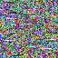
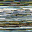
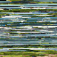
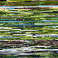
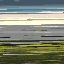
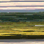

A minimal GPT-style transformer trained directly on raw pixel tokens to generate images: no diffusion or VAE. Based on the original [NanoGPT by Andrej Karpathy](https://github.com/karpathy/nanoGPT)

Trained on my [synthetic dataset with forest/field landscapes](https://huggingface.co/datasets/ferrariedhgs/Nature-Landscape)

This project explores what happens when you treat images exactly like language:

- Flatten image into token sequence

- Train a causal transformer

- Generate pixel-by-pixel

## Example Outputs

Early training:

Noise

Horizontal streaks

Line stitching artifacts

Later training:

Structured bands

Sky/grass separation

Coherent texture regions

Output after 200, 400, 800, 1600, 3000, 6000 and 10000 training iterations









Untill 200 iterations the images produced are just noise, altough some grass patches can be seen. Actual coherent images appear around 3000 iterations

## Usage
The model takes the value of the first pixel in the image and generates the rest based on it

```python
import model
import extras
import numpy as np
import pickle

#load model
ckpt_path = os.path.join(out_dir,'old', 'ckpt6000.pt')
checkpoint = torch.load(ckpt_path, map_location=device)
gptconf = GPTConfig(**checkpoint['model_args'])
model = GPT(gptconf)

#load model params
meta_path = os.path.join(os.path.dirname(os.path.realpath(__file__)),"data","bmp",'meta.pkl')
load_meta = os.path.exists(meta_path)
with open(meta_path, 'rb') as f:
    meta = pickle.load(f)

x = torch.tensor([[0xFEC]], dtype=torch.long, device=device) #init the first pixel with a set 12bit color
y = model.generate(x, max_new_tokens=4095, temperature=temperature) #generate the image

#turn the resulted array into a 2d array
pixels = y[0, 1:].cpu().numpy()
pixels = np.append(pixels, pixels[-1])   #duplicate last value because i set the block size wrong when training
img = pixels.reshape(64, 64)

extras.save_bmp(img,f'out/images/output6000.png') #save the image
```
## How It Works

Images are treated as token arrays.

Each pixel:

Original: 3 × 8 bits (RGB)

Quantized: take the most significant 4 bits of each channel

Packed into a 12-bit token

This results in 2^12 = 4096 token vocabulary

Images are resized to 64×64 for this experiment.

Instead of using row separators, the entire image (4096 tokens) is fed at once during training.

## Observations

The first pixel strongly influences the entire generation.

Horizontal bias emerges due to raster-order tokenization.

Loss reduction does not always correlate with perceptual improvement.

## Limitations

Very slow generation (4096 sequential steps)

Strong horizontal bias

No explicit 2D inductive bias

Small model capacity (~1.3M parameters)

Not comparable to diffusion models in quality

This project is an educational and experimental exploration of pure autoregressive image modeling.
